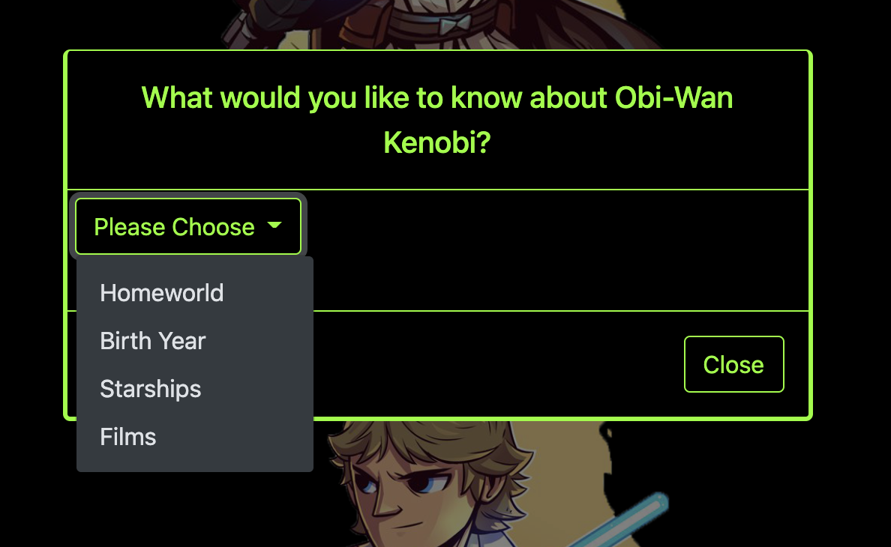
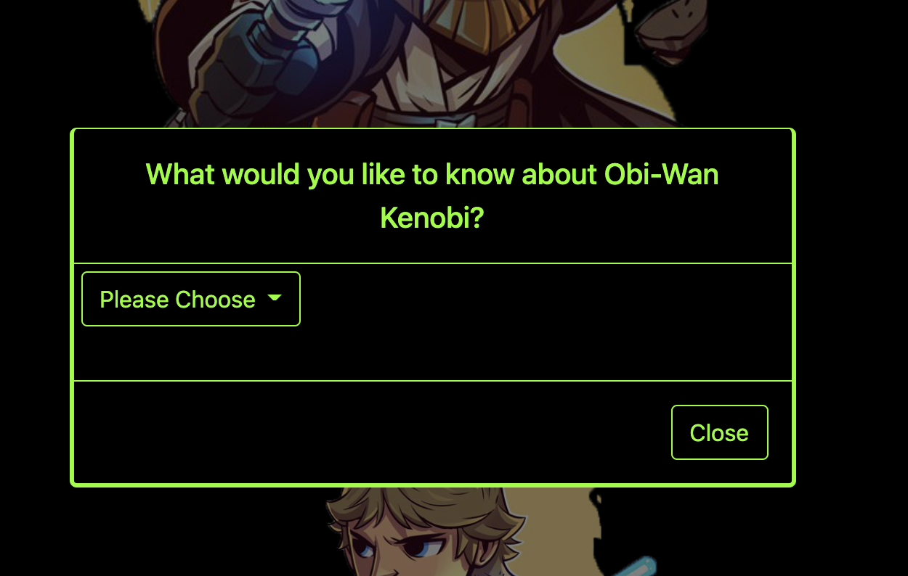

# Star Wars API Page

For this project, my team used a set of parameters to practice calling an api and practice basic styling.
(Images on page are the artwork of https://www.dereklaufman.com)

## Acceptance Criteria:

### SPACE WARS AND LASER SWORDS!

- Use the Star Wars API to create site.
- Utilize TWO endpoints (there are many).
- Combine the data from these endpoints to generate a single page.
- Have a form to accept user input.

  - eg. Perform a search of API data based on a keyword from a user.
  - eg. Filter out data from a response based on user input, update the DOM accordingly.
  - eg. Have a user "submit" a question to a character and return and answer.
     Example questions might be: "What is your homeworld?" or "What ship do you pilot?"

  ## Highlights

  
  
  
  
